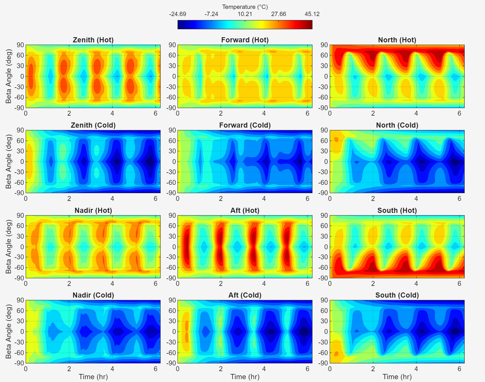
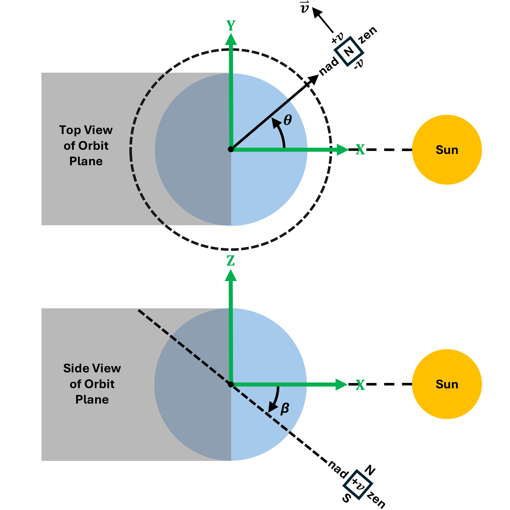

# Satellite Thermal Model (SATMO)
SATMO is a MATLAB® program designed for conducting preliminary thermal analysis of small satellites in low-altitude circular orbits around Earth and other Solar System bodies. SATMO currently supports satellites orbiting all major planets, the Moon, and Pluto. For more info, view the corresponding [SATMO paper](https://arxiv.org/abs/2512.07896).

  

## Installation

Download and run the [`SATMO.mltbx`](SATMO.mltbx) file. SATMO will then be available under the **APPS** tab in MATLAB.

---
## Instructions

### 1. Populate the *Analysis Inputs* Tab

- Select the analysis mode:  
  - **Generic**: Runs simulations over a range of hot- and cold-case beta angles.  
  - **Specific**: Runs simulations at one hot- and one cold-case beta angle.
- Enter beta angles, orbital parameters, simulation parameters, and primary-body constants.
  

  

### 2. Populate the *Satellite Data* Tab

- Specify physical, thermo-optical, heater, and solar-panel properties for each face and the internal component.  
- Populate the conduction-coefficient matrix.

  

### 3. Run SATMO

- If the model fails to run, try reducing the time step.

### 4. Analyze the Results
Available outputs include:
- Beta angle evolution and % of orbit in sunlight over calendar date (specific analysis mode)
- Environmental heat fluxes absorbed by the satellite surfaces  
- Satellite surface and internal node temperatures  
- Solar-panel power outputs (if applicable)

---
## Satellite Nodes

Click to expand

  
The satellite is modeled as a six-sided box, with one face-centered node per surface and one internal node representing a component inside the satellite.

| **Node Name** | **Symbol** | **Description** |
|------------------|------------|-----------------|
| Zenith           | `zen`      | On the surfcae opposing the primary body |
| Nadir            | `nad`      | On the surface facing the primary body |
| Forward          | `+v`       | On the surface facing the orbital velocity vector |
| Aft              | `-v`       | On the surface opposing orbital velocity vector |
| North            | `N`        | On the surface facing the orbit normal vector |
| South            | `S`        | On the surface opposing the orbit normal vector |
| Internal         | `int`      | Represents a component within the satellite |

-  θ (orbit angle): Satellite position along its orbit, measured from the subsolar point of the orbit (solar noon).
-  β (beta angle): Angle between the primary body-sun vector and the satellite orbital plane.

---
## Heat Sources 

Click to expand

  
- Direct solar radiation  
- Reflected solar radiation (albedo) from the primary body  
- Infrared (IR) radiation emitted by the primary body  
- Conduction between satellite surfaces  
- Heaters  
- Internal heat loads from electronics

SATMO iteratively calculates the heating contributions on each satellite surface and updates each surface temperature over the specified time steps using an energy-balance method applied at each face-centered node.

---

## Modeling Assumptions

Click to expand

- The satellite is modeled as a box with one face-centered node per surface and one internal node 
- Material properties are constant over each face and component
- The satellite orbit is circular and low altitude (altitude << primary body radius)  
- The only orbital perturbation factor included is the J2 effect
- The satellite attitude is nadir-pointing at all times
- The shadow model is cylindrical and only includes the umbra region, neglecting effects from ring structures and moons if applicable
- The Sun-primary body system is fixed in space, and only the satellite moves using 2-body orbital dynamics  
- The primary body does not block the satellite's view to space when exchanging thermal radiation with deep space
- Free molecular heating and charged particle heating are neglected
- Internal radiation within the satellite is not modeled
- All solar energy incident on the solar panels is absorbed as heat in the hot case 
- Power is continuously drawn off the solar arrays in the cold case
- Light-time delay in computing solar longitude from JPL Horizons is ignored, meaning the raw apparent solar longitude from Horizons is approximated as the true solar longitude  
- Area-weighted thermo-optical properties are used when solar panels cover part of a satellite face  
- Primary body properties and heating parameters inputs are constant

  

---
## Inputs used for Validating SATMO with Thermal Desktop®

Click to expand

  
### Test Matrix

| **Test Case** | **Primary Body** | **Beta Angle (deg)** | **Orbit Altitude (km)** | **Simulation Duration (s)** | **Time Step (s)** |
|---------------|------------------|----------------------|-------------------------|-----------------------------|-------------------|
| E1 | Earth | 0 | 400 | 27,768.10 | 1.0 |
| E2 | Earth | 45 | 400 | 27,768.10 | 1.0 |
| E3 | Earth | 90 | 400 | 27,768.10 | 1.0 |
| E4 | Earth | 0 | 800 | 30,262.00 | 1.0 |
| E5 | Earth | 45 | 800 | 30,262.00 | 1.0 |
| E6 | Earth | 90 | 800 | 30,262.00 | 1.0 |
| E7 | Earth | 0 | 35,786 | 430,819.00 | 1.0 |
| E8 | Earth | 45 | 35,786 | 430,819.00 | 1.0 |
| E9 | Earth | 90 | 35,786 | 430,819.00 | 1.0 |
| L1 | Moon | 0 | 400 | 44,357.15 | 1.0 |
| L2 | Moon | 45 | 400 | 44,357.15 | 1.0 |
| L3 | Moon | 90 | 400 | 44,357.15 | 1.0 |
| M1 | Mars | 0 | 400 | 35,506.50 | 1.0 |
| M2 | Mars | 45 | 400 | 35,506.50 | 1.0 |
| M3 | Mars | 90 | 400 | 35,506.50 | 1.0 |
| V1 | Venus | 0 | 400 | 28,564.30 | 1.0 |
| V2 | Venus | 45 | 400 | 28,564.30 | 1.0 |
| V3 | Venus | 90 | 400 | 28,564.30 | 1.0 |

### **Planetary data constants**
|                           | **Venus**     | **Earth**     | **Moon**       |   **Mars**     |
|---------------------------|---------------|---------------|----------------|----------------|
| **Radius (km)**            | 6,051.800     | 6,378.137     | 1738.100      |  3,396.200
| **Mass (kg)**              | 4.8673e+24    | 5.9722e+24    | 7.3460e+22     | 6.4169e+23 
| **Equatorial inclination (deg)** | 2.64    | 23.44         | 1.54          | 25.19 
| **J2 constant**           | 4.45800e-6    | 1.08263e-3    | 2.27000e-4     | 1.96045e-3
| **Solar flux (W/m²)**      | 2,759         | 1,414         | 1,421            | 717   
| **Albedo factor**         | 0.82          | 0.40          | 0.073           | 0.29
| **Sun-side IR flux (W/m²)**| 153           | 275           | 1,314            | 315
| **Dark-side IR flux, (W/m²)**| 153           | 275          | 5.2            | 315

### Properties of each satellite surface
| **SATMO Field**              | **Input** |
|-------------------------------|-----------|
| Mass (kg)                     | 0.25      |
| Area (m²)                     | 0.010     |
| Specific heat (J/kg·K)        | 896.0     |
| Absorptivity                  | 1.0       |
| Emissivity                    | 1.0       |
| Initial temperature (°C)      | 20.0      |
| Additional heat load (W)      | 0.50      |

### Heaters and heater control properties of each satellite face
| **SATMO Field**        | **Input** |
|------------------------|-----------|
| Heater power (W)       | 1.0       |
| Bang-bang control      | On        |
| On trigger (°C)        | 0.0       |
| Off trigger (°C)       | 10.0      |

### Solar panel properties of each satellite face
| **SATMO Field**        | **Input** |
|------------------------|-----------|
| Mounting               | None      |
| Face coverage (%)      | N/A       |
| Efficiency             | N/A       |
| Absorptivity           | N/A       |
| Emissivity             | N/A       |

### **Conductance matrix between surfaces of the satellite in this work, in W/K**
|        | **Zenith** | **Nadir** | **Forward** | **Aft** | **North** | **South** |
|--------|------------|-----------|-------------|---------|-----------|-----------|
| **Zenith**  | 0      | 0     | 0.12    | 0.12 | 0.12  | 0.12  |
| **Nadir**   | 0      | 0     | 0.12    | 0.12 | 0.12  | 0.12  |
| **Forward** | 0.12   | 0.12  | 0       | 0    | 0.12  | 0.12  |
| **Aft**     | 0.12   | 0.12  | 0       | 0    | 0.12  | 0.12  |
| **North**   | 0.12   | 0.12  | 0.12    | 0.12 | 0     | 0     |
| **South**   | 0.12   | 0.12  | 0.12    | 0.12 | 0     | 0     |

---
## Acknowledgements

This material is based upon work supported by the National Science Foundation (NSF) Graduate Research Fellowship Program under Grant No. DGE-2039655. Any opinions, findings, conclusions, or recommendations expressed in this material are those of the author(s) and do not necessarily reflect the views of the NSF.

---

## How to Cite

Alexander Chipps, Daniel Forgette and Kerri Cahoy. "SATMO: A Multi-Planet Thermal Analysis Tool for CubeSat Missions," AIAA 2026-2269. AIAA SCITECH 2026 Forum. January 2026.
